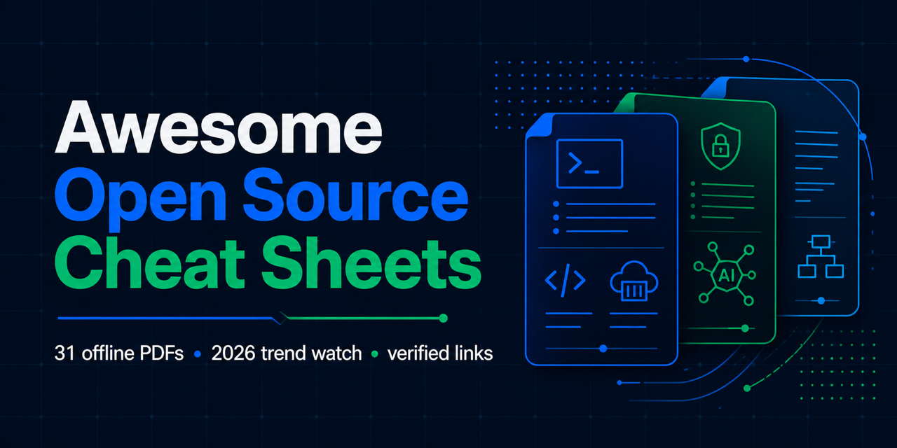

# Awesome Open Source Cheat Sheets

[](https://awesome.re)
[](https://github.com/sraodev/awesome-opensource-cheat-sheets/actions/workflows/validate.yml)
[](TRENDING_2026.md)
[](#offline-pdf-archive)
[](CONTRIBUTING.md)

[](#contents)

Save time searching documentation: use **maintained quick references** for AI agents, Linux, Git, Python, TypeScript, Docker, Kubernetes, security, and more, plus **31 downloadable PDFs** for offline use.

> If this collection saves you time, [star the repository](https://github.com/sraodev/awesome-opensource-cheat-sheets) so you can find it again and help other developers discover it.

> [!NOTE]
> The archived PDFs come from the original Opensource.com collection and may describe older versions. The current links below were reviewed on **2026-08-24**.

## Contents

- [2026 open-source trends and evidence](TRENDING_2026.md)
- [Current official quick references](#current-official-quick-references)
- [Offline PDF archive](#offline-pdf-archive)
- [How resources are selected](#how-resources-are-selected)
- [Suggest a resource](https://github.com/sraodev/awesome-opensource-cheat-sheets/issues/new?template=resource.yml)
- [Contribution guide](CONTRIBUTING.md)

## Pick the right reference

| You need | Start here |
|---|---|
| Current commands and workflows | [Official quick references](#current-official-quick-references) |
| AI, agent, security, and infrastructure signals | [2026 trend watch](TRENDING_2026.md) |
| A printable or offline reference | [PDF archive](#offline-pdf-archive) |
| A missing or outdated resource fixed | [Open a focused issue](https://github.com/sraodev/awesome-opensource-cheat-sheets/issues/new/choose) |

## Current official quick references

These links favor project-owned documentation so that the content can evolve with the software.

| Focus | Quick reference | Why it belongs in the 2026 edition |
|---|---|---|
| AI agents | [Model Context Protocol documentation](https://modelcontextprotocol.io/docs/getting-started/intro) | Open standard for connecting AI applications to tools and data. |
| AI coding agents | [Cline IDE tutorial](https://docs.cline.bot/usage/ide) | Approval-based workflow for an open-source coding agent. |
| AI model serving | [vLLM quickstart](https://docs.vllm.ai/en/latest/getting_started/quickstart/) | Current reference for open-model inference and serving. |
| RAG and context | [RAGFlow quick start](https://github.com/infiniflow/ragflow#-get-started) | Open-source retrieval, document processing, and agent context. |
| Agent security | [OWASP Agentic Security Initiative](https://genai.owasp.org/initiatives/agentic-security-initiative/) | Practical threat, MCP, and agent-security guidance. |
| TypeScript | [Official TypeScript cheat sheets](https://www.typescriptlang.org/cheatsheets/) | Printable references for types, interfaces, classes, and control flow. |
| Python tooling | [uv getting started guide](https://docs.astral.sh/uv/getting-started/) | Fast, reproducible Python project and package management. |
| Containers | [Docker CLI cheat sheet](https://docs.docker.com/get-started/docker_cheatsheet.pdf) | Current command reference for images and containers. |
| Kubernetes | [kubectl quick reference](https://kubernetes.io/docs/reference/kubectl/quick-reference/) | Versioned, maintained commands for cluster operations. |
| Observability | [OpenTelemetry quick starts](https://opentelemetry.io/docs/getting-started/) | Vendor-neutral traces, metrics, and logs. |
| Supply-chain security | [OpenSSF OSPS Baseline](https://baseline.openssf.org/) | Actionable minimum security controls for open-source projects. |
| Build provenance | [SLSA quick start](https://slsa.dev/how-to/get-started) | Practical steps for generating and verifying build provenance. |
| Infrastructure as code | [OpenTofu CLI reference](https://opentofu.org/docs/cli/) | Open-source infrastructure-as-code command reference. |
| Creative AI workflows | [ComfyUI documentation](https://docs.comfy.org/) | Open, node-based workflows for generative media. |
| Local-first automation | [Home Assistant getting started](https://www.home-assistant.io/getting-started/) | Community-driven home automation that can run locally. |

## Offline PDF archive

### Command line and Linux

| Cheat sheet | Covers |
|---|---|
| [Bash](cheat_sheets/cheat_sheet_bash.pdf) | Shell navigation, scripting, shortcuts, and common commands. |
| [curl](cheat_sheets/curl-cheat-sheet.pdf) | HTTP requests, options, authentication, and API calls. |
| [FreeDOS](cheat_sheets/cheat_sheet_freedos_v2.pdf) | Common DOS command-line tools. |
| [GNU awk](cheat_sheets/cheat_sheet_gnuawk_v3.pdf) | Text processing, fields, patterns, and actions. |
| [GNOME 3](cheat_sheets/cheat_sheet_gnome3_v2.pdf) | Desktop navigation and keyboard shortcuts. |
| [i3 window manager](cheat_sheets/cheat_sheet_i3windowmanager_v2.pdf) | Essential i3 navigation and window management. |
| [Linux commands](cheat_sheets/cheat_sheet_linux_common_commands.pdf) | Files, processes, packages, and services. |
| [Linux firewall](cheat_sheets/osdc_cheatsheet-firewall-2.pdf) | Firewall concepts and command examples. |
| [Linux networking](cheat_sheets/cheat_sheet_linuxnetworking_v2.pdf) | Network inspection and administration utilities. |
| [Linux users and permissions](cheat_sheets/cheat_sheet_linux_permissions_0.pdf) | Ownership, modes, users, and groups. |
| [SELinux](cheat_sheets/cheat_sheet_selinux_v2.pdf) | Security contexts, modes, and troubleshooting. |
| [SSH](cheat_sheets/cheat_sheet_ssh_v4.pdf) | Remote access, configuration, keys, and tunneling. |

### Programming and templating

| Cheat sheet | Covers |
|---|---|
| [Go](cheat_sheets/cheat_sheet_go.pdf) | Language syntax and common patterns. |
| [Java](cheat_sheets/cheat_sheet_java.pdf) | Core language syntax and concepts. |
| [Jinja2](cheat_sheets/osdc_cheatsheet-jinja2.pdf) | Python template syntax, filters, and control flow. |
| [Lua](cheat_sheets/cheat_sheet_lua.pdf) | Syntax, data structures, variables, and functions. |
| [pip](cheat_sheets/cheat_sheet_pip.pdf) | Python package installation and management. |
| [Python 3.7](cheat_sheets/cheat_sheet_python37_v2.pdf) | Introductory built-ins and syntax. Historical version. |

### DevOps, containers, and architecture

| Cheat sheet | Covers |
|---|---|
| [Containers primer](cheat_sheets/containers_primer_v2.pdf) | Linux container vocabulary and fundamentals. |
| [Git](cheat_sheets/cheat_sheet_git_final.pdf) | Everyday workflow, branches, remotes, and flags. |
| [kubectl](cheat_sheets/cheat_sheet_kubectl.pdf) | Kubernetes troubleshooting and cluster commands. Historical version; prefer the [current quick reference](https://kubernetes.io/docs/reference/kubectl/quick-reference/). |
| [Microservices](cheat_sheets/cheat_sheet_microservices.pdf) | Design and operational concepts for distributed services. |

### Editors, design, and documents

| Cheat sheet | Covers |
|---|---|
| [Blender](cheat_sheets/cheat_sheet_blender_v2.pdf) | Common hotkeys and mouse controls. |
| [Emacs](cheat_sheets/cheat_sheet_emacs.pdf) | Essential editing commands and keyboard shortcuts. |
| [Groff macros](cheat_sheets/cheat_sheet_groff_v2.pdf) | The `me`, `ms`, and `mm` macro sets. |
| [Inkscape](cheat_sheets/cheat_sheet_inkscape.pdf) | Common vector-design tools and shortcuts. |
| [Markdown](cheat_sheets/markdown_cheat_sheet_opensource.com_.pdf) | Common syntax and GitHub/GitLab rendering. |
| [Pandoc](cheat_sheets/cheat_sheet_pandoc.pdf) | Common document-conversion options. |
| [Vim](cheat_sheets/cheat_sheet_vim_final_v2_0.pdf) | Essential modes, movement, and editing commands. |

### Hardware and open-source discovery

| Cheat sheet | Covers |
|---|---|
| [Open-source software alternatives](cheat_sheets/cheat_sheet_open_source_alternatives_0.pdf) | Alternatives to common proprietary applications. |
| [Raspberry Pi](cheat_sheets/cheat_sheet_rpi.pdf) | Setup, networking, SSH, software, and updates. |

## How resources are selected

A new entry should be:

- useful as a quick reference rather than a long course;
- publicly accessible and maintained by an open-source project or trusted community;
- clear about its source and redistribution terms;
- current, or explicitly labeled as historical;
- free of affiliate links and tracking parameters.

See [CONTRIBUTING.md](CONTRIBUTING.md) for the submission checklist.

## Automated validation

The [validation workflow](.github/workflows/validate.yml) runs for pull requests, changes to `master`, every Monday, and on demand. It checks:

- local Markdown targets and repository boundaries;
- one-to-one coverage of all archived PDFs in this README;
- matching review dates that are no more than 120 days old;
- live external links, with retries and a job summary.

Run the deterministic checks locally before opening a pull request:

```bash
python3 scripts/validate_collection.py
```

## Help this collection grow

- **Star** it to keep the references one click away.
- **Share** the most useful sheet with a teammate, study group, or open-source community.
- **Contribute** one focused improvement: a maintained reference, a repaired link, or a clearer description.

See a problem? [Report a broken or outdated link](https://github.com/sraodev/awesome-opensource-cheat-sheets/issues/new?template=broken-link.md) or [suggest a cheat sheet](https://github.com/sraodev/awesome-opensource-cheat-sheets/issues/new?template=resource.yml).

## Acknowledgements and licensing

The original repository attributed the PDF collection to [Opensource.com](https://opensource.com/downloads/cheat-sheets) and described it as available under the [Creative Commons Attribution 2.0 license](https://creativecommons.org/licenses/by/2.0/). Check each PDF for embedded attribution and licensing information before redistributing it; asset-specific terms prevail.

Linked resources remain under the terms published by their respective projects.
